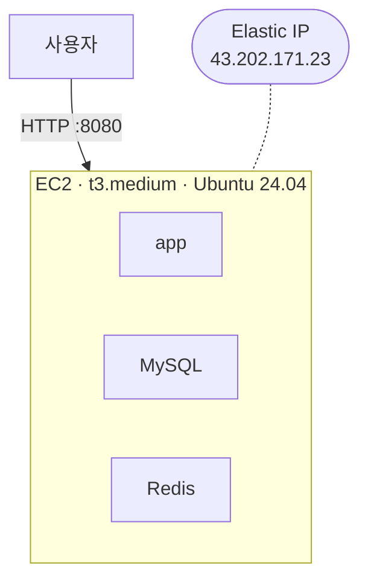

# 인프라 문서 (DrawRace2026-extended)

> 이 저장소는 팀 프로젝트(`Programmers-Intern-Program / INT1-Project-Team05`)의 포크로,
> 담당 역할(user 도메인 + 인프라 + 배포) 중 **인프라/배포 부분을 솔로로 더 깊게 확장**하기 위한 작업 공간이다.
> 이 문서는 현재 인프라 상태, 확장 로드맵, 그리고 각 확장 단계를 실제로 구현하는 근거를 정리한다.

---

## 1. 현재 상태 — Tier 0 (단일 EC2 모놀리스)

| 항목 | 값 |
| --- | --- |
| 인스턴스 | `i-045dfcef819e2639d` · t3.medium (vCPU 2 / 4GB) · Ubuntu 24.04 |
| 고정 IP | Elastic IP `43.202.171.23` (`eipalloc-00cdb98cb66d179f1`) |
| 네트워크 | 계정 기본 VPC `vpc-04964d75bbc0125f4` / 기본 서브넷 `subnet-02564bbb2ab677c28` |
| 보안그룹 | `sg-066219142f7be9193` — inbound 22, 8080 (자세한 내용은 아래 [알려진 제약](#5-알려진-제약과-선결-조건)) |
| 런타임 | Docker Compose로 `app` + `MySQL` + `Redis` 3개 컨테이너, `restart: unless-stopped` |
| AWS 계정 | `272736188148` (ap-northeast-2 / 서울) |

### CI/CD

| 단계 | 내용 |
| --- | --- |
| CI (`.github/workflows/ci.yml`) | PR · `main`/`develop` push마다 — JDK 21, Redis 서비스 컨테이너, Spotless, `./gradlew build` |
| 이미지 빌드·배포 (`.github/workflows/deploy.yml`) | 릴리즈 태그(`v*.*.*`) push → Docker 이미지 빌드 → GHCR push → EC2에 SSH 접속 후 `docker compose pull && up -d` |
| 롤백 | Actions 탭에서 `workflow_dispatch`로 이전 태그 지정 → 재빌드 없이 해당 이미지로 즉시 재배포 |

배포 트리거를 `main` push가 아니라 **릴리즈 태그**로 둔 이유: 별도의 장수명 deploy 브랜치를 두면 `main`과 drift가 생기고, "무엇이 배포됐는지"가 브랜치 상태에 숨는다. 태그는 불변이라 "이 커밋이 이 버전으로 배포됨"이 명시적으로 남는다.

### IaC (Terraform)

`infra/terraform/` — Tier 0 리소스를 코드로 편입한 상태 (커밋 `7b692bd`, 주석 보강 `13ad6d2`).

| 파일 | 역할 |
| --- | --- |
| `provider.tf` | AWS provider `~> 5.0` 고정, 리전 변수화 |
| `variables.tf` | `aws_region`, `key_name` (default 존재) |
| `main.tf` | VPC/서브넷/키페어는 **data 블록**(조회만), 보안그룹·EC2·EIP는 **resource 블록** |
| `outputs.tf` | `instance_id`, `public_ip`, `security_group_id` |

- VPC·서브넷·키페어는 계정 기본 객체이거나 Terraform이 관리할 수 없는 대상(개인키)이라 **data 블록으로 참조만** 한다 — Terraform이 만들거나 지우지 않는다.
- 보안그룹·EC2·EIP는 콘솔에서 이미 만들어져 있던 것을 `terraform import`로 가져왔다. **destroy/재생성 없이** state에만 편입했고, 이후 `terraform plan`은 "No changes"에 도달한 상태.
- `.terraform.lock.hcl`은 커밋한다(프로바이더 버전 재현용). `.terraform/`, `*.tfstate*`, `*.tfvars`는 `.gitignore` 처리.
- **state는 로컬 전용**이다 — S3 + DynamoDB 원격 백엔드는 아직 없다. 다른 머신에서 작업하려면 state를 옮기거나 import를 다시 해야 한다. (원격 백엔드 도입은 Tier 1과 함께 검토)

---

## 2. 확장 로드맵 (Tier 0 → 3)

각 tier는 "지금 필요한 것"이 아니라 **"사용자가 늘면 순서대로 드러나는 한계"**에 대응한다.
Tier 2·3은 지금 상시로 켜두면 실사용자 0명 상태에서 로드밸런서·오토스케일링 비용만 나가므로 **설계 스케치**로만 둔다.
IaC를 쓰는 이유가 곧 "필요해지면 `terraform apply` 한 번으로 몇 분 내 켤 수 있다"는 것이기도 하다.

| Tier | 추가되는 것 | 도입 트리거 (이 신호가 보이면 착수) | 상태 |
| --- | --- | --- | --- |
| **0** | EC2 1대에 app + MySQL + Redis, Docker Compose | — (현재 기준선) | ✅ 완료 · Terraform 코드화 |
| **1** | MySQL → RDS, Redis → ElastiCache 로 분리 | stateful(DB/캐시)과 stateless(app)가 한 인스턴스 메모리를 경쟁 → 수직 확장으로는 앱을 수평 복제할 수 없음 | 🔜 구현 예정 |
| **2** | ALB + Auto Scaling Group, app 인스턴스 N대 무상태 복제 | 단일 인스턴스의 CPU/커넥션이 한계, 또는 무중단 배포가 필요 | 📐 설계만 |
| **3** | 2개 이상 AZ 분산 배치 + CloudWatch 모니터링/알림 | 가용성 요구가 생김 (AZ 단일 장애가 전체 다운으로 이어지면 안 됨) | 📐 설계만 |

> **부하 분산 ≠ 게임의 리전 서버.** Tier 2의 여러 EC2는 같은 DB·같은 캐시를 공유하는 무상태 복제본이라
> 어느 서버로 요청이 가든 결과가 같다. 게임의 아시아/북미 서버는 지연시간 때문에 **의도적으로 갈라놓은 독립 배포**(DB도 분리)로, 개념이 다르다.

---

## 3. Tier 1 도입 근거

솔로 포트폴리오에서 "사용자 0명인데 왜 RDS/ElastiCache를 붙였나"는 질문에 답하기 위한 근거표.

| 축 | 내용 |
| --- | --- |
| **트리거 (실제로 겪은 것)** | Tier 0 배포 과정(2026-08-27)에서 t3.small(2GB)에 올렸더니 Linux OOM Killer가 반복 발동 — 컨테이너 재시작 209회. `dmesg`로 host-level OOM 확인. t3.medium(4GB) **수직 확장**으로 해소. 이 과정에서 app(stateless) + MySQL/Redis(stateful)가 한 인스턴스 메모리를 공유하는 구조 자체가 병목임을 확인했다. |
| **확장 고려** | Tier 2(app 다중 인스턴스)는 상태 저장소가 인스턴스 밖에 있어야 성립한다. Tier 1의 계층 분리는 그 **선결 조건**이다 — 지금 하지 않으면 나중에 수평 확장 자체가 막힌다. |
| **실증 목적** | 4-tier 로드맵을 문서로만 두지 않고, 각 단계의 **트리거 조건과 트레이드오프를 실제 구현으로 검증**한다. Tier 1이 그 첫 실증 단계 — "분리하면 무엇이 좋아지고 무엇을 대가로 치르는지"를 코드·비용·배포 검증까지 직접 확인한다. |
| **트레이드오프 (명시)** | ① **비용 증가**: 현재 ~$37/mo (t3.medium 1대) → Tier 1 ~$55/mo (t3.small ~$19 + RDS db.t3.micro ~$21 + ElastiCache cache.t3.micro ~$15), 월 **약 $18 추가**. 비용은 이득이 아니라 대가다. 수직 확장의 비용 문제는 *현재 요금*이 아니라 *미래 천장*(t3.large ~$75, xlarge ~$150)에 있다. ② **관리 포인트 증가**: 서브넷 그룹, 파라미터 그룹, 백업 윈도우, 엔드포인트 관리가 새로 생긴다. ③ **여전히 단일 리전/단일 AZ** — AZ 장애 대응은 Tier 3의 몫으로 남는다. |

**시점 정리 (혼동 주의):** OOM → t3.medium 전환은 Terraform 작업 *이전*, 수동 배포 중에 일어났다. Terraform은 이미 t3.medium이 된 상태를 import했을 뿐이다. 따라서 근거는 "Terraform 하다가"가 아니라 **"Tier 0 배포 과정에서"**다.

---

## 4. Tier 1 구현 계획

> 아직 착수 전. 아래는 재개 시 따를 순서.

1. **네트워크/보안** (Terraform)
   - 2개 이상 AZ에 걸친 DB 서브넷 그룹 (`aws_db_subnet_group`, `aws_elasticache_subnet_group`)
   - RDS/ElastiCache 전용 보안그룹 — source를 **app의 보안그룹으로만** 제한 (`0.0.0.0/0` 아님)
2. **리소스 provisioning** (Terraform, import 아님 — 신규 생성)
   - `aws_db_instance` (MySQL, db.t3.micro, 백업 보존 설정)
   - `aws_elasticache_cluster` (Redis, cache.t3.micro)
3. **애플리케이션 배선**
   - `docker-compose.prod.yml`에서 `mysql` / `redis` 서비스 제거
   - EC2의 `.env`를 새 RDS/ElastiCache 엔드포인트로 교체
   - EC2 인스턴스 타입을 t3.small로 축소 검토 (app만 남으므로)
4. **재배포 + 검증**
   - 새 태그 push → 배포 → `curl -X POST http://43.202.171.23:8080/api/auth/guest`로 200 + JWT 확인
   - RDS의 `users` 테이블에 게스트 row가 실제로 들어갔는지 확인 (로컬/EC2 검증 때와 동일한 기준)
   - 데이터 마이그레이션 없음 (보존할 실데이터 없음 — Docker 컨테이너화 때 결정과 동일)
5. (함께 검토) Terraform **원격 state 백엔드**(S3 + DynamoDB lock) 도입 — 리소스가 늘면서 로컬 state의 리스크가 커짐

예상 작업량 2~3시간 + 상시 과금되는 RDS/ElastiCache 비용 추가.

---

## 5. 알려진 제약과 선결 조건

| 항목 | 내용 | 언제까지 |
| --- | --- | --- |
| **SimpleBroker** | `WebSocketConfig.java`가 `registry.enableSimpleBroker("/sub")` — Spring 인메모리 STOMP 브로커, 단일 JVM 프로세스 범위. app을 2대 이상으로 늘리면 같은 게임방의 두 유저가 다른 인스턴스에 배정될 때 **에러 없이 조용히** 서로 메시지를 못 받는다. Redis Pub/Sub 또는 RabbitMQ 릴레이로 교체 필요. | **Tier 2 착수 전 필수** |
| **보안그룹 SSH 개방** | 22번 포트가 `0.0.0.0/0`으로 열려 있다 (`main.tf` 주석에도 명시). 내 IP로 좁히거나 SSM Session Manager로 전환하는 게 맞다. | Tier 1과 함께 정리 권장 |
| **Terraform state 로컬 전용** | 원격 백엔드 없음. 다른 머신에서 작업 불가, state 파일 유실 리스크. | Tier 1 (§4-5) |
| **8080 직접 노출** | ALB/HTTPS 없이 앱 포트를 그대로 외부 공개. Tier 2에서 ALB 도입 시 자연 해소. | Tier 2 |

---

## 참고

- `Desktop/인프라 확장/확장-청사진.html` — 4-tier 진행도, 부하분산 vs 리전서버 비교, SimpleBroker 실패 모드를 손그림 SVG로 정리한 학습 노트
- `Desktop/인프라 확장/컨테이너-매니페스트.html` — Docker/CI-CD 개념 정리 (이미지 vs 컨테이너, 멀티스테이지 빌드, 태그 기반 배포 등)
