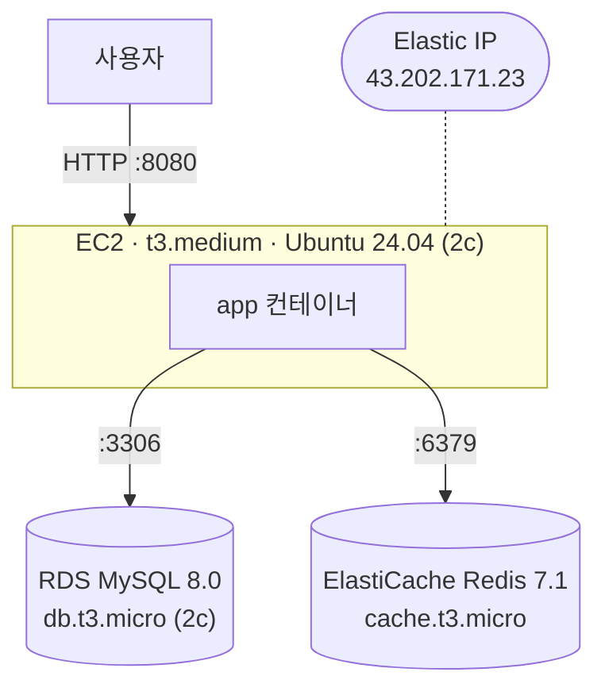
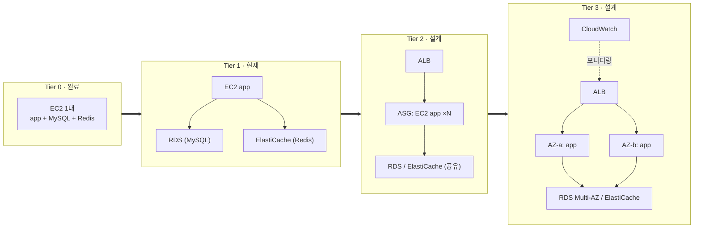

# 인프라 문서 (DrawRace2026-extended)

> 이 저장소는 팀 프로젝트(`Programmers-Intern-Program / INT1-Project-Team05`)의 포크로,
> 담당 역할(user 도메인 + 인프라 + 배포) 중 **인프라/배포 부분을 솔로로 더 깊게 확장**하기 위한 작업 공간이다.
> 이 문서는 현재 인프라 상태, 확장 로드맵, 그리고 각 확장 단계를 실제로 구현하는 근거를 정리한다.

---

## 1. 현재 상태 — Tier 1 (관리형 DB/캐시 분리)

2026-09-03에 Tier 0(단일 EC2 모놀리스)에서 Tier 1로 전환 완료. MySQL·Redis를
EC2 컨테이너에서 관리형 서비스(RDS·ElastiCache)로 분리했다. EC2에는 `app`
컨테이너 하나만 남는다.

| 항목 | 값 |
| --- | --- |
| 인스턴스 | `i-045dfcef819e2639d` · t3.medium (vCPU 2 / 4GB) · Ubuntu 24.04 · AZ `ap-northeast-2c` |
| 고정 IP | Elastic IP `43.202.171.23` (`eipalloc-00cdb98cb66d179f1`) |
| 네트워크 | 계정 기본 VPC `vpc-04964d75bbc0125f4` / 기본 서브넷 `subnet-02564bbb2ab677c28` (2c) |
| RDS | `drawrace2026-mysql` · MySQL 8.0 · db.t3.micro · 20GB gp3 (→100GB 오토스케일) · 단일 AZ (2c) · 백업 7일 · 비공개(`publicly_accessible=false`) |
| ElastiCache | `drawrace2026-redis` · Redis 7.1 · cache.t3.micro · 노드 1개 |
| 보안그룹 (app) | `sg-066219142f7be9193` — inbound 22, 8080 (자세한 내용은 아래 [알려진 제약](#5-알려진-제약과-선결-조건)) |
| 보안그룹 (RDS) | `drawrace2026-rds` — inbound 3306, **source = app 보안그룹만** |
| 보안그룹 (Redis) | `drawrace2026-redis` — inbound 6379, **source = app 보안그룹만** |
| 런타임 | EC2에 `app` 컨테이너 1개 (`docker-compose.prod.yml`, `restart: unless-stopped`). DB·Redis 접속 host는 EC2 `.env`의 `DB_HOST`/`REDIS_HOST`로 주입 |
| AWS 계정 | `272736188148` (ap-northeast-2 / 서울) |

> EC2의 `.env`(git 미추적)에 `DB_HOST`(RDS 엔드포인트), `REDIS_HOST`(ElastiCache
> 엔드포인트), `DB_PASSWORD`(RDS 마스터 비밀번호)가 설정돼 있어야 앱이 뜬다.
> 값은 `terraform output rds_endpoint` / `redis_endpoint`로 확인.

### CI/CD

| 단계 | 내용 |
| --- | --- |
| CI (`.github/workflows/ci.yml`) | PR · `main`/`develop` push마다 — JDK 21, Redis 서비스 컨테이너, Spotless, `./gradlew build` |
| 이미지 빌드·배포 (`.github/workflows/deploy.yml`) | 릴리즈 태그(`v*.*.*`) push → Docker 이미지 빌드 → GHCR push → EC2에 SSH 접속 후 `origin/main`의 `docker-compose.prod.yml` 체크아웃 → `docker compose pull app && up -d --remove-orphans` |
| 롤백 | Actions 탭에서 `workflow_dispatch`로 이전 태그 지정 → 재빌드 없이 해당 이미지로 즉시 재배포 |

배포 트리거를 `main` push가 아니라 **릴리즈 태그**로 둔 이유: 별도의 장수명 deploy 브랜치를 두면 `main`과 drift가 생기고, "무엇이 배포됐는지"가 브랜치 상태에 숨는다. 태그는 불변이라 "이 커밋이 이 버전으로 배포됨"이 명시적으로 남는다.

### IaC (Terraform)

`infra/terraform/` — Tier 0 리소스는 `terraform import`로 편입, Tier 1 리소스는 신규 생성.

| 파일 | 역할 |
| --- | --- |
| `provider.tf` | AWS provider `~> 5.0` 고정, 리전 변수화 |
| `variables.tf` | `aws_region`, `key_name`, `db_name`/`db_username`/`db_password`(sensitive, default 없음) |
| `main.tf` | **Tier 0** — VPC/서브넷/키페어는 data 블록(조회만), 보안그룹·EC2·EIP는 resource(import됨) |
| `tier1.tf` | **Tier 1** — RDS·ElastiCache·전용 보안그룹 2개·서브넷 그룹·파라미터 그룹 (전부 신규 생성) |
| `outputs.tf` | `instance_id`, `public_ip`, `security_group_id`, `rds_endpoint`, `redis_endpoint` |

- VPC·서브넷·키페어는 계정 기본 객체이거나 Terraform이 관리할 수 없는 대상(개인키)이라 **data 블록으로 참조만** 한다.
- Tier 0의 보안그룹·EC2·EIP는 콘솔에서 만든 것을 `terraform import`로 **destroy 없이** state에만 편입했다.
- Tier 1 리소스(RDS·ElastiCache 등)는 import할 원본이 없어 `terraform apply`로 **신규 생성**했다 (`Plan: 7 to add, 0 to change, 0 to destroy` — Tier 0 무영향).
- DB 접속정보는 `terraform.tfvars`(`.gitignore`)에 두고 코드/state 밖에 둔다.
- `.terraform.lock.hcl`은 커밋한다. `.terraform/`, `*.tfstate*`, `*.tfvars`는 `.gitignore` 처리.
- **state는 여전히 로컬 전용**이다 — S3 + DynamoDB 원격 백엔드 미도입. 리소스가 7개 늘어난 만큼 state 유실 리스크가 커졌다. ([§5](#5-알려진-제약과-선결-조건) 참고)

---

## 2. 확장 로드맵 (Tier 0 → 3)

각 tier는 "지금 필요한 것"이 아니라 **"사용자가 늘면 순서대로 드러나는 한계"**에 대응한다.
Tier 2·3은 지금 상시로 켜두면 실사용자 0명 상태에서 로드밸런서·오토스케일링 비용만 나가므로 **설계 스케치**로만 둔다.
IaC를 쓰는 이유가 곧 "필요해지면 `terraform apply` 한 번으로 몇 분 내 켤 수 있다"는 것이기도 하다.

| Tier | 추가되는 것 | 도입 트리거 (이 신호가 보이면 착수) | 상태 |
| --- | --- | --- | --- |
| **0** | EC2 1대에 app + MySQL + Redis, Docker Compose | — (기준선) | ✅ 완료 · Terraform 코드화 |
| **1** | MySQL → RDS, Redis → ElastiCache 로 분리 | stateful(DB/캐시)과 stateless(app)가 한 인스턴스 메모리를 경쟁 → 수직 확장으로는 앱을 수평 복제할 수 없음 | ✅ 완료 (2026-09-03) |
| **2** | ALB + Auto Scaling Group, app 인스턴스 N대 무상태 복제 | 단일 인스턴스의 CPU/커넥션이 한계, 또는 무중단 배포가 필요 | 📐 설계만 |
| **3** | 2개 이상 AZ 분산 배치 + CloudWatch 모니터링/알림 | 가용성 요구가 생김 (AZ 단일 장애가 전체 다운으로 이어지면 안 됨) | 📐 설계만 |

> **부하 분산 ≠ 게임의 리전 서버.** Tier 2의 여러 EC2는 같은 DB·같은 캐시를 공유하는 무상태 복제본이라
> 어느 서버로 요청이 가든 결과가 같다. 게임의 아시아/북미 서버는 지연시간 때문에 **의도적으로 갈라놓은 독립 배포**(DB도 분리)로, 개념이 다르다.

---

## 3. Tier 1 도입 근거

솔로 포트폴리오에서 "사용자 0명인데 왜 RDS/ElastiCache를 붙였나"는 질문에 답하기 위한 근거표.

| 축 | 내용 |
| --- | --- |
| **표준 형태로의 복귀** | "컴퓨트에 app + 관리형 DB + 관리형 캐시"가 웹 서비스의 교과서적 기본형이다. Tier 0(한 박스에 다 몰아넣기)이 오히려 비용·단순함을 위해 압축한 형태였고, Tier 1은 과잉 설계가 아니라 표준으로 돌아온 것이다. |
| **트리거 (실제로 겪은 것)** | Tier 0 배포 과정(2026-08-27)에서 t3.small(2GB)에 올렸더니 Linux OOM Killer가 반복 발동 — 컨테이너 재시작 209회. `dmesg`로 host-level OOM 확인. t3.medium(4GB) **수직 확장**으로 해소. 이 과정에서 app(stateless) + MySQL/Redis(stateful)가 한 인스턴스 메모리를 공유하는 구조 자체가 병목임을 확인했다. |
| **확장 고려** | Tier 2(app 다중 인스턴스)는 상태 저장소가 인스턴스 밖에 있어야 성립한다. Tier 1의 계층 분리는 그 **선결 조건**이다 — 지금 하지 않으면 나중에 수평 확장 자체가 막힌다. |
| **실증 목적** | 4-tier 로드맵을 문서로만 두지 않고, 각 단계의 **트리거 조건과 트레이드오프를 실제 구현으로 검증**한다. Tier 1이 그 첫 실증 단계 — "분리하면 무엇이 좋아지고 무엇을 대가로 치르는지"를 코드·비용·배포 검증까지 직접 확인했다. |
| **트레이드오프 (명시)** | ① **비용 증가**: Tier 0 ~$38/mo (t3.medium 1대) → 현재 ~$74/mo (t3.medium 유지 + RDS db.t3.micro ~$21 + ElastiCache cache.t3.micro ~$15), 월 **약 $36 추가**. EC2를 t3.small로 축소하면 ~$55/mo(+$17)까지 내려가지만, 앱 단독 메모리(~1.1GB)가 2GB에 다시 아슬아슬해서 축소는 보류(§4 후속). 비용은 이득이 아니라 대가다. 수직 확장의 비용 문제는 *현재 요금*이 아니라 *미래 천장*(t3.large ~$75, xlarge ~$150)에 있다. ② **관리 포인트 증가**: 서브넷 그룹, 파라미터 그룹, 백업 윈도우, 엔드포인트, EC2 `.env`의 접속정보 관리가 새로 생긴다. ③ **여전히 단일 리전/단일 AZ** — RDS·EC2 모두 `ap-northeast-2c`. AZ 장애 대응은 Tier 3의 몫으로 남는다. |

**시점 정리 (혼동 주의):** OOM → t3.medium 전환은 Terraform 작업 *이전*, 수동 배포 중에 일어났다. Terraform은 이미 t3.medium이 된 상태를 import했을 뿐이다. 따라서 근거는 "Terraform 하다가"가 아니라 **"Tier 0 배포 과정에서"**다.

---

## 4. Tier 1 구현 내역 (2026-09-03 완료)

| 단계 | 내용 | 상태 |
| --- | --- | --- |
| **네트워크/보안** (Terraform) | 2 AZ(2c+2a) DB·캐시 서브넷 그룹, RDS/Redis 전용 보안그룹 — source를 **app 보안그룹으로만** 제한 (`0.0.0.0/0` 아님) | ✅ |
| **리소스 신규 생성** (Terraform) | `aws_db_instance.mysql` (MySQL 8.0, db.t3.micro, 20GB gp3, 백업 7일), `aws_elasticache_cluster.redis` (Redis 7.1, cache.t3.micro), `aws_db_parameter_group` (utf8mb4) | ✅ |
| **애플리케이션 배선** | `docker-compose.prod.yml`에서 `mysql`/`redis` 서비스 제거, DB/Redis host를 `.env`의 `DB_HOST`/`REDIS_HOST`로 주입. `deploy.yml`에 `--remove-orphans` 추가 | ✅ |
| **재배포 + 검증** | EC2에서 새 compose로 전환 → `curl -X POST .../api/auth/guest` 201 + JWT 확인 → RDS `users` 테이블에 게스트 row(`is_guest=1`) 실제 저장 확인. Redis는 로그인 플로우(refresh token 저장) 정상 동작으로 확인. 데이터 마이그레이션 없음 | ✅ |

### 후속 (Tier 1 범위지만 아직 안 함)

| 항목 | 이유 |
| --- | --- |
| EC2 t3.small 축소 | app 단독으로도 부팅 메모리 ~1.1GB라 2GB에 아슬아슬. OOM 재발 리스크 vs 월 ~$19 절감. 별도로 신중히 판단 |
| Terraform 원격 state 백엔드 (S3 + DynamoDB lock) | 리소스가 7개 늘어 로컬 state 유실 리스크가 커짐. 다음 작업 후보 |
| 보안그룹 SSH `0.0.0.0/0` 축소 | [§5](#5-알려진-제약과-선결-조건) |

---

## 5. 알려진 제약과 선결 조건

| 항목 | 내용 | 언제까지 |
| --- | --- | --- |
| **SimpleBroker** | `WebSocketConfig.java`가 `registry.enableSimpleBroker("/sub")` — Spring 인메모리 STOMP 브로커, 단일 JVM 프로세스 범위. app을 2대 이상으로 늘리면 같은 게임방의 두 유저가 다른 인스턴스에 배정될 때 **에러 없이 조용히** 서로 메시지를 못 받는다. Redis Pub/Sub 또는 RabbitMQ 릴레이로 교체 필요. (Tier 1에서 ElastiCache가 생겼으므로 Redis Pub/Sub 릴레이 전환 경로는 열림) | **Tier 2 착수 전 필수** |
| **Terraform state 로컬 전용** | 원격 백엔드 없음. 다른 머신에서 작업 불가, state 파일 유실 리스크 (Tier 1로 관리 리소스 7개 증가). | 다음 작업 후보 (§4 후속) |
| **보안그룹 SSH 개방** | 22번 포트가 `0.0.0.0/0`으로 열려 있다 (`main.tf` 주석에도 명시). 내 IP로 좁히거나 SSM Session Manager로 전환하는 게 맞다. | 원격 state와 함께 정리 권장 |
| **RDS 비암호화 연결** | 앱→RDS JDBC URL이 `useSSL=false`. VPC 내부 + 보안그룹으로 막혀 있어 당장 위험은 낮지만, `require_secure_transport` + TLS로 조일 여지. | Tier 3 (보안 하드닝) |
| **8080 직접 노출** | ALB/HTTPS 없이 앱 포트를 그대로 외부 공개. Tier 2에서 ALB 도입 시 자연 해소. | Tier 2 |

---

## 참고

- `Desktop/인프라 확장/확장-청사진.html` — 4-tier 진행도, 부하분산 vs 리전서버 비교, SimpleBroker 실패 모드를 손그림 SVG로 정리한 학습 노트
- `Desktop/인프라 확장/컨테이너-매니페스트.html` — Docker/CI-CD 개념 정리 (이미지 vs 컨테이너, 멀티스테이지 빌드, 태그 기반 배포 등)
